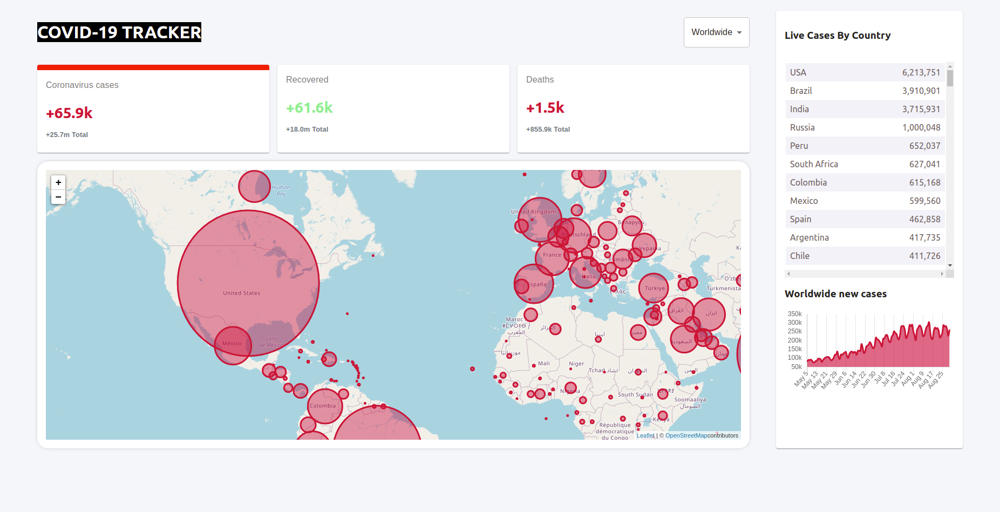
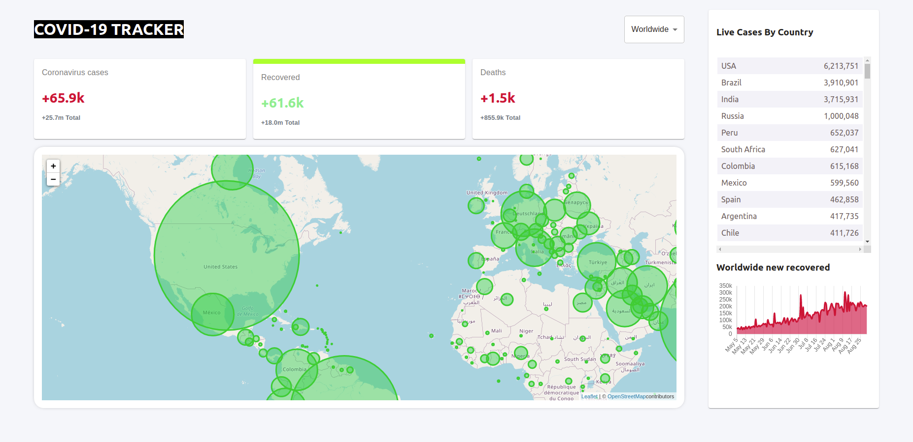

# Building a COVID-19 Tracker with React

## Technologies

- React
- React-DOM
- Create-React-App
- React Hooks
- React Router
- Eslint
- npm
- CSS

## Live Version 
<a href="https://covid-tracker-mo.netlify.app/" target="_blank" > Live version </a>

## Usage 

### Clone the project: 
 - git clone https://github.com/MouhaDiouf/covid_tracker
 
 ### Run the project
 - to install the dependencies run the command : npm install 
 - after installation, run the command: npm start

## Description 
This is a covid-19 tracker app built with React. It uses the http://disease.sh/ API to show real-time data to the users (worldwide and by country)

## Developed by

Mouhamadou Diouf ( <a href="https://github.com/MouhaDiouf"> @mouhad </a>)

Let's connect on: 

-  <a href="https://www.linkedin.com/in/mouha-diouf/" target="_blank" > LinkedIn </a>
- <a href="https://twitter.com/mouhamadiouf" target="_blank"> Twitter</a>

You can also check <a href="https://mouhadiouf.com/" target="_blank"> my portfolio </a>

## Potential Future Improvements 

- Create an admin dashboard to manage users
- Implement an auto-login using the browser cookies 

## Contributing

1. Fork it (https://github.com/MouhaDiouf/covid_tracker)
2. Create your feature branch (git checkout -b feature/[choose-a-name])
3. Commit your changes (git commit -am 'What this commit will fix/add')
4. Push to the branch (git push origin feature/[chosen name])
5. Create a new Pull Request
